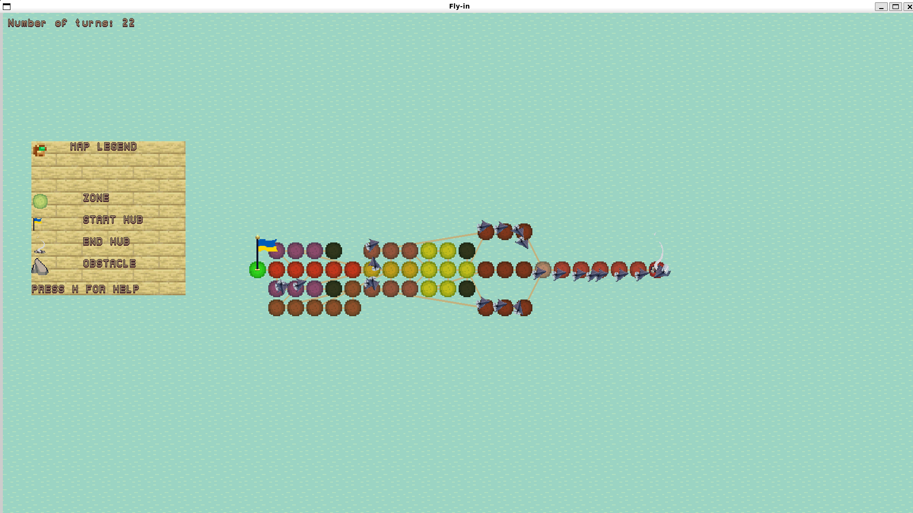
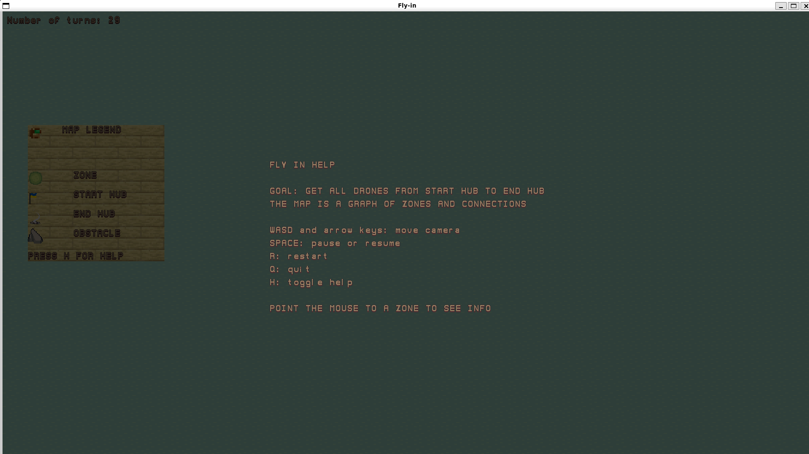
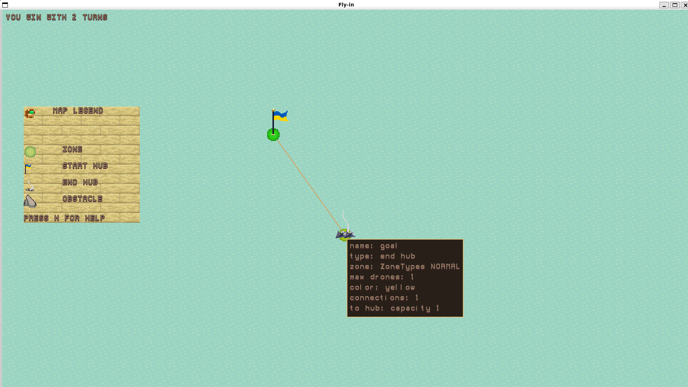

# Fly-in

*This project has been created as part of the 42 curriculum by mnestere*

Fly-in is a graph-based drone routing simulator with real-time Pygame visualization. The goal is to move all drones from a start hub to an end hub while respecting map constraints:

- **Zone type costs** — `normal`, `restricted`, `priority`, `blocked`
- **Per-zone occupancy caps** — `max_drones` limits simultaneous occupancy
- **Per-connection throughput caps** — `max_link_capacity` limits traffic per turn

The project combines three core layers: strict parsing and validation of map files, capacity-aware multi-drone route planning over discrete turns using timed A*, and a visual simulation with layered rendering for real-time inspection.

---

## End-to-End Pipeline

```
  main.py
  InformationManager.run
         │
         ▼
  InputParser
  parse_lines + parse_input
         │
         ▼
  GameWorld
  resolve start/end hubs
         │
         ▼
  Renderer
  assets + zone layout
         │
         ▼
  RoutePlanner
  movement model + A*
         │
         ▼
  FleetRoutePlanner
  plan_all_drones
         │
         ▼
  TimedPathfinder  ◄─────────────────────┐
  state = zone, turn                     │
         │                               │
         ▼                               │
  TurnCapacityTracker                    │
  reserve zone/link usage ───────────────┘
         │
         ▼
  DroneArmada
  apply planned routes
       │         │
       ▼         ▼
  Simulation   Layer stack
  Output       Water › Map › Flags › Drones › HUD
  VII.5 lines        │
                     ▼
               Pygame display
```

---

## Instructions

### Prerequisites
- Python 3.11+
- A working display environment for Pygame

### Installation

Option A — using `uv`:
```bash
uv sync
```

Option B — using `pip`:
```bash
python3 -m venv .venv
source .venv/bin/activate
python3 -m pip install pygame-ce
```

### Run
```bash
python3 main.py maps/easy/01_linear_path.txt
```

You can run any map from `maps/easy`, `maps/medium`, `maps/hard`, or `maps/challenger`.

### Run parser tests
```bash
python3 -m unittest unit_tests.tests.test_parser_error_maps -v
```

---

## Map File Format

The first non-comment line must be `nb_drones: <positive_integer>`. Then define hubs and connections:

```txt
nb_drones: 3

start_hub: hub 1 0 [color=green]
end_hub: goal 1 15 [color=yellow]
hub: corridorA 4 3 [zone=priority color=green max_drones=2]
hub: obstacleX 10 17 [zone=blocked color=gray]

connection: hub-corridorA
connection: corridorA-goal [max_link_capacity=2]
```

| Metadata key        | Applies to | Description                                         |
|---------------------|------------|-----------------------------------------------------|
| `zone`              | Hub        | Zone type: normal / restricted / priority / blocked |
| `color`             | Hub        | Display color in the visualizer                     |
| `max_drones`        | Hub        | Max simultaneous drone occupancy                    |
| `max_link_capacity` | Connection | Max drones traversing per turn                      |

---

## Algorithm

### 1. Base routing model — A*

`RoutePlanner` performs A* on the zone graph with vertices as zone names, edges as map connections, `g(n)` as the cumulative enter-cost using zone type, `h(n)` as the straight-line Euclidean distance on zone coordinates, and tie-breaking that explores `priority` zones first when `f` is equal.

### 2. Why static shortest paths are insufficient

A plain shortest path per drone ignores time, failing to prevent zone overcrowding (multiple drones in a zone at the same turn beyond `max_drones`), link congestion (too many drones on a link in the same turn beyond `max_link_capacity`), and congestion cascades caused by restricted zones with larger turn weights. **Capacity constraints are temporal, not just topological.**

### 3. Timed pathfinding

The planner is split into two levels: the spatial model (`RoutePlanner` + `ZoneMovementModel`) handles passability, zone costs, and heuristic; the temporal conflict solver (`TimedPathfinder` + `TurnCapacityTracker`) handles turn-indexed occupancy and reservation.

```
  [ Drone i: start → goal ]
              │
              ▼
       ┌─ Expand state ─────────────────────────────┐
       │   zone, turn                               │
       │                                            │
       ▼                                            ▼
  [ Wait ]                                     [ Move ]
  zone t → t+1                            zone_a t → t+w
       │                                            │
       ▼                                            ▼
  Zone cap available at t?            Link + dest cap t → t+w?
       │                                            │
   yes │  no                                 yes    │  no
       │   └──────────────┐     ┌─────────────┘     │
       │                  │     │                   │
       │                  └─────┘                   │
       │               (skip, re-expand) ◄──────────┘
       │
       ▼
  Priority heap  f = g + h
       │
       ▼
  Reached end hub?
       │
    no │  yes
       │    └──► Reconstruct timed path
       │                  │
       │                  ▼
       │         Reserve in TurnCapacityTracker
       │                  │
       └──────────────────┘ (plan next drone)
```

### 4. Fleet strategy

`FleetRoutePlanner` plans drones sequentially using a shared capacity tracker. Each drone finds a path and then reserves its capacity usage, so later drones route around already-reserved slots. Start and end hubs are exempted from occupancy caps for throughput. This approach is simple, deterministic, and robust for constrained map challenges.

### 5. Simulation output

`SimulationOutput` converts timed states into VII.5 line format per turn. Arrivals emit `Dk-zone` when a drone enters a zone. Transitions emit `Dk-from-to` while crossing multi-turn edges. Only turns with at least one move are emitted — idle turns are skipped.

---

## Pathfinding Complexity

- A* (single drone, static graph): typically `O((V + E) log V)` time, `O(V)` memory.
- Timed search: state space grows with time horizon `T`, so worst-case is `O((V·T + E·T) log(V·T))`.
- Fleet planning: timed search repeated for each drone, with increasing reservation pressure.

In practice, bounding the time horizon and using priority queues keeps runs tractable on the provided maps.

---

## Visual Representation

The visual layer makes routing behavior inspectable, not merely cosmetic.

### Rendering layers (bottom to top)

| Layer   | Purpose                            |
|---------|------------------------------------|
| Water   | Animated background                |
| Map     | Zones with metadata-driven tinting |
| Flags   | Start/end hub markers              |
| Drones  | Animated, oriented sprites         |
| Legend  | Zone type reference                |
| HUD     | Turn counter, pause/win state      |
| Tooltip | Zone details on hover              |
| Help    | Keyboard controls overlay          |

### Interactive features

- **Camera panning** — WASD or arrow keys for large maps
- **Frame-by-frame control** — pause/resume to inspect states
- **Visual debugging** — conflicts and bottlenecks visible as drone queues and slowdowns
- **Multi-turn transitions** — restricted-zone behavior easier to reason about visually

### Screenshots

**Showcase**



**Help menu**



**Showcase of the ToolTipHUD**



---

## Controls

| Key                     | Action              |
|-------------------------|---------------------|
| `W/A/S/D` or arrow keys | Move camera         |
| `SPACE`                 | Pause / resume      |
| `R`                     | Restart and re-plan |
| `H`                     | Toggle help overlay |
| `Q`                     | Quit                |

---

## Project Structure

### Core modules

| Module                 | Responsibility                                         |
|------------------------|--------------------------------------------------------|
| `parser.py`            | Strict parsing, validation, and metadata handling      |
| `game.py`              | Immutable world model (`GameWorld`)                    |
| `routing_costs.py`     | Zone cost and passability abstraction                  |
| `pathfinding.py`       | A* route planner with heuristic                        |
| `timed_pathfinding.py` | Time-expanded search and capacity reservation          |
| `fleet_planner.py`     | Multi-drone orchestration and sequential planning      |
| `drone.py`             | Route execution in simulation time with pixel movement |
| `simulation_output.py` | VII.5 textual output formatter                         |

### Rendering system

| Module            | Responsibility                         |
|-------------------|----------------------------------------|
| `render.py`       | Main renderer and camera management    |
| `layers.py`       | Layer stack composition                |
| `assets.py`       | Asset loading and caching              |
| `sprites.py`      | Sprite abstractions                    |
| `drone_sprite.py` | Animated drone sprite with orientation |

---

## Resources

- [Pygame documentation](https://www.pygame.org/docs/)
- [Python `heapq` documentation](https://docs.python.org/3/library/heapq.html)
- [A* search algorithm — Wikipedia](https://en.wikipedia.org/wiki/A*_search_algorithm)
- [Space-time A* concepts](https://w9-pathfinding.readthedocs.io/stable/mapf/SpaceTimeAStar.html)
- [Silver 2005 — Cooperative Pathfinding (AAAI)](https://www.aaai.org/Papers/AAAI/2005/AAAI05-094.pdf)
